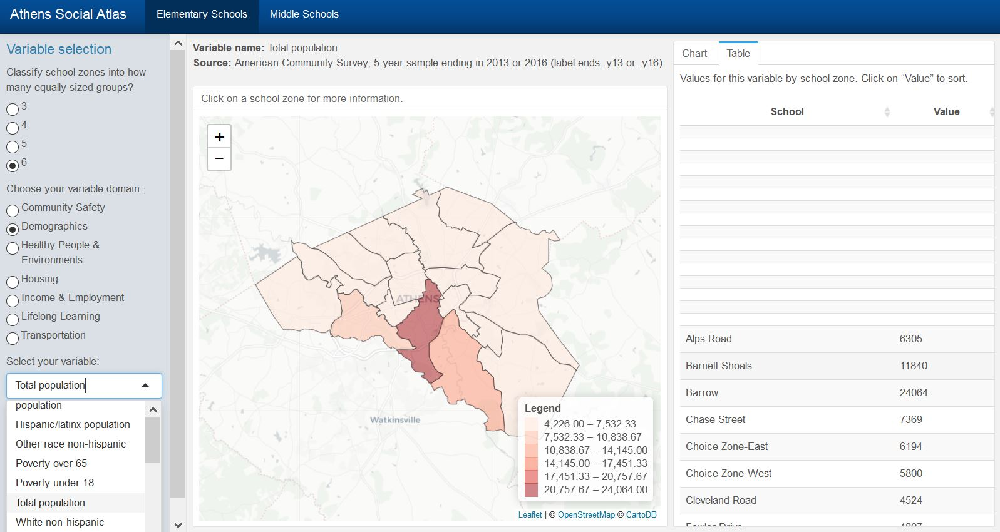
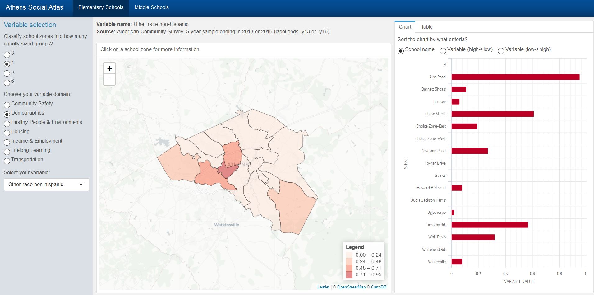

# 100 Days Of Code - Log

### Day 1: April 3, 2018

**Today's Progress**: 
I started messing around with the Blogdown package in attempt to create a personal website(second take). I successfully decided on a template and made a new site. I am using [Creating Websites With Blogdown](https://bookdown.org/yihui/blogdown/) to try to figure this all out.
 

**Thoughts:** 
Again, I am burning the midnight oil due to troubleshooting. I had some initial problems with starting a new site, but I guess sleep deprivation prevented me from processing the sentence about everything needing to be in an empty directory. I am happy I at least got the page loading. I am going to pay for staying up this late this tomorrow at my  morning Brazilian Jiu Jitsu session at 7:30, which will be the first time I did BJJ in a bit. I know that has nothing to do with coding, but where's the lie in that statement. 

**Link to work:** 
I am not in the mood nor have the extra energy to expend to mess around with GitHub other than modifying this page, so you're going to have to wait ;).

### Day 2: April 4, 2018

**Today's Progress:**
I worked on trying to deploy my site which involves GitHub and Netlify. I really didn't get that far. After accidentally deleting my site, I successfully did upload the files on my github repo. 
 

**Thoughts:** 
The struggle with me and GitHub continues. I was feeling good about myself but have been beaten down due to trying to deploy this website on Netlify which is apparently supposed to be easy. While the blogdown book says that it only takes a few minutes to deploy a site...I worked over an hour to get it done and I still wasn't able to. The lies, the lies, the lies. Really it would be wise to stray away from giving such time limits given coders of a variety of abilities try to work through these things. Given that I worked 1.5 hours on this...I will be deducting that from my one hour of coding tomorrow.

**Link to work:** 
https://github.com/momiji15/dscott

### Day 3: April 5, 2018

**Today's Progress:**
I finally was able to deploy my site on Netlify. My issue was that I did not have the version of Hugo needed to deploy the site. I'm sure I would have caught that earlier if I wasn't running on E. No burning the midnight oil today due to coding!
 

**Thoughts:** 
I will most probably change the domain name for my site, but this will do for now. I will say the domain name given to me puts a smile on my face.

**Link to work:** 
https://nervous-kilby-15b1f7.netlify.com/

### Day 4: April 5, 2018

**Today's Progress:** 
- Added content to my blog.
- Added information in the about page.
 

**Thoughts:** 
I did add content to two pages....but having a bit of a problem...updating the site! I tried deploying my site and I failed. So after on hour and 45 minutes on this...it's time to put it down and go to bed. And this is totally being deducted from the next two of days of coding. 

**Link to work:** 
Did do commits to my repo: https://github.com/momiji15/dscott/tree/master/public

### Day 5: April 7, 2018

**Today's Progress:** 
I have little time today because tonight is UFC 223 but given how much time I spent yesterday on my code, I just docked off that time today. Today's short coding session was dedicated to salvaging my blog post that I accidentally deleted through reverting commits and maybe some other things in which I have the slightest idea what I did. I'm satisfied that I at least pushed my blog post to my repo, but still am having problems with deploying the site.
 

**Thoughts:** 
I can't even get too upset because I am in UFC fight night mode. I will deal with it tomorrow.

**Link to work:** 
https://github.com/momiji15/dscott/blob/master/content/blog/2018-04-07-100-days-of-code-challenge-the-sequel.md

### Day 6: April 8, 2018

**Today's Progress:** 
- Learned how to remove files on my GitHub repository but keep those files locally
- Got my site to work locally

**Thoughts:** 
I'm going to try to start as much from square one as I can before I just throw my hands up and just start anew. I deleted some of my folders in my GitHub repo. I didn't know how to do that, so I consulted my friend Google to teach me how. I have no idea what I did, but now my blogdown site is able to build locally through the serve_site() function. Before, I was getting some error message about the the local directory not being changed. I just added a url to the config.toml and commented out the publishDir and somehow it all worked. Still don't get why though.

**Link to work:** 
Nothing to show regarding my blog, BUT I did update my page on how to know how to do things with GitHub so that's at least something:
https://github.com/momiji15/gittingit/blob/master/howto.md

### Day 7: April 9, 2018

**Today's Progress:** 
- Remove the Projects section on my site for the time being.
- Adding a profile photo.
- Successfully deployed my site!

**Thoughts:** 
After one week of working on my personal site, I finally have successfully updated and deployed my site! I found out that what was triggering the error message was the `publishDir` command that I had in my `config.toml` file. From reading the documentation, I somehow got the idea that it was necessary, but it's actually not if you use Netlify to deploy the site. I'm assuming this is only when you want to create a public folder locally and you want to drag the folder to Netlify(which is an option for those who are not familiar with GitHub. 

I would also like to give props to [Peter Baumgartner](https://notes.peter-baumgartner.net/tutorial/blogdown-tutorial-part-1/) on his very good tutorial on how to get a blogdown site up and running.

**Link to work:** 
Personal website is finally up and running!!!
https://nervous-kilby-15b1f7.netlify.com/

### Day 8: April 10, 2018

**Today's Progress:**
- Did some reconfiguring of the Projects section which involved deleting the "Writing" section and adding a "Projects and Courses" 
  section.
- Figured out how to do external links to other pages.

**Thoughts:**
I almost thought I wouldn't be able to use the theme for my personal website because I couldn't figure out the external links thing, but lo and behold I figured it out. Slowly but surely I'm getting the hang of blogdown!

**Link to Work:**
https://nervous-kilby-15b1f7.netlify.com/

### Day 9: April 11, 2018

**Today's Progress:**
- Added a "GIS and Data Science" section in the Projects part of my website.
- Added some new images.

**Thoughts:**
It was kind of a pain to link the images on the websites, but it seems that once I got rid of the numbers in the file name it worked. 

**Link to Work:**
https://nervous-kilby-15b1f7.netlify.com/

### Day 10: April 12, 2018

**Today's Progress:**
- Scrapped the "GIS and Data Science" section in the Projects part of my website.
- Added a NASA DEVELOP part in the Projects part of my website.

**Thoughts:**
1/10th of the way done with the challenge!!! I was somewhat tempted to drop this current web design because I really hate how big the pictures are in the Projects section, however I decided to take a different approach to my Projects page. Instead of working against the design of the template, I decided to work with the design. I will add each project separately with a corresponding image instead of grouping them all in one section.

**Link to Work:**
https://nervous-kilby-15b1f7.netlify.com/

### Day 11: April 13, 2018

**Today's Progress:**
- Added a Data Science for Social Good - Atlanta part in the Projects part of my website.

**Thoughts:**
Since I worked 1.5 hours yesterday on this page, I only coded for 30 minutes today. Kind of all worked itself out since I was extremely busy today and had to do some midnight coding. Making some steady progress on my personal page so I am pleased so far.

**Link to Work:**
https://nervous-kilby-15b1f7.netlify.com/

### Day 12: April 14, 2018

**Today's Progress:**
- Added disqus to my website.
- Updated the photography page.

**Thoughts:**
A little bit under the weather today so I made sure to stop at exactly an hour. Tomorrow I will finish off working ony website for the time being and add a blog post and then I will  move on to focus on improving a Shiny app. I've been doing the Shiny course in DataCamp to better understand the framework, and I am already having some ideas on how some things(i.e. undoing some of the hard coding of categories in a dropdown menu and having it self-populate) so I'll test those waters starting tomorrow.

**Link to Work:**
https://nervous-kilby-15b1f7.netlify.com/

### Day 13: April 15, 2018

**Today's Progress:**
- Added a blog post about the conference I attended.
- Forked a repo for a project I will be working on to my GitHub.

**Thoughts:**
Still under the weather so I didn't do much, but I still allocated an hour to do the work. I am trying to figure out how to use GitHub via RStudio and I have been looking at [Happy Git and GitHub for the useR](http://happygitwithr.com/) by Jenny Bryan and the TAs from the STATS 545 class. I am just o...k...a...y with doing it from the command line. Well I get what I need to get done, done so that's good enough for me. I will start to get cracking with this project on updating a Shiny app tomorrow and see what's going on with the code. 

**Link to Work:**
https://nervous-kilby-15b1f7.netlify.com/

### Day 14: April 17, 2018

**Today's Progress:**
- Looking under the hood of this Athens Social Atlas Shiny App

**Thoughts:**
Slow progress today...just trying to learn the ins and outs of the app. I cannot get it to work on my computer so I am working on trying to get it to work.

**Link to Work:**
None yet!

### Day 15: April 19, 2018

**Today's Progress:**
- Got the variable descriptions to load dynamically in the dropdown menu for the Athens Social Atlas Shiny App

**Thoughts:**
To be honest, it's been a rough couple of days since I've been sick. I wasn't able to do anything yesterday, but I picked it up back today. This is the first day I actually feel somewhat decent. I am pleasantly surprised that I was able to figure out one piece of the puzzle rather quickly. The main issue at hand with the Athens Social Atlas app is to get the variable descriptions to load dynamically. Thanks to what I have learned so far in the Building Web Applications with Shiny DataCamp course, I was able to figure it out. I have a feeling if I keep on going, I can figure out the second part of the puzzle, which is to get the descriptions to load dynamically based on a filter. It's extremely gratifying to see what you learn actually be applied to tackle an issue!

**Link to Work:**
None yet, but I can promise you I saw a dropdown menu with some descriptions that were not hard-coded :).

### Day 16: April 20, 2018
**Today's Progress:**
- Came up with a rough way to have the data subsetted by category and have the variable descriptions to load dynamically.

**Thoughts:**
I think I might have figured out the first task with updating the app. The first task to do with this app has to do with having the variable descriptions to be loaded dynamically. One piece of this is to make sure the data is filtered first by category (Crime, Safety, etc) and then have the descriptions to be loaded dynamically. It's a "rough" workaround, but I got it to work for one category and reduces the lines of code too. Tomorrow I'm going to continue on and see what happens.

**Link to Work:** 
None yet, sowee!! You'll just have to take my words for it! 

### Day 17: April 21, 2018
**Today's Progress:**
- Finished up changing the code for the rest of the categories in the app so the variable descriptions can dynamically load.

**Thoughts:**
I only did 30 minutes of code today due to two reasons: 1. I need to do other stuff 2. I have a thing about when I finish a task, that's it. I will code for 30 minutes longer tomorrow. I'm pretty pleased that I was able to solve that issue in relatively a short amount of time. Hopefully it is sufficient of a solution. I also made sure to add detailed comments on what I did...nothing worse than changing code and not commenting!!! 

**Link to Work:** 
Sorry Charlie, not today. 

### Day 18: April 22, 2018
**Today's Progress:**
- Added a button for middle school data.
- Got the variable descriptions to dynamically load for one of the variables of the Two Issue section of the app.

**Thoughts:**
Made up for the short coding session yesterday and coded for 1.5 hours today. I realized that I was not finished with yesterday's accomplishment for all the sections of the app so I went ahead and changed the code for Two Issue part of the app in which you can select two variables and compare them. I'm having issues with getting things to work properly for the second variable so that's going to be what tomorrow's hour of code will be reserved for!

**Link to Work:** 
Finally made a commit to the repo so here's a peek under the hood: https://github.com/momiji15/awp_shiny_april2018/blob/master/socialatlas_2018_04.Rmd

### Day 19: April 23, 2018
**Today's Progress:**
- Figured out how to get my forked repo up to date with the master repo.

**Thoughts:**
To be honest, half of the time was dedicating to figure out how to get my forked repo up to date with the master repo. And then the rest of the time was dedicated to scratching my head trying to figure out how to implement the next step. The next step is to map the selected variables. I need to figure out how to do that within a reactive expression. 

**Link to Work:** 
https://github.com/momiji15/gittingit/blob/master/howto.md

### Day 20: April 24, 2018
**Today's Progress:**
- None. :( 

**Thoughts:**
Still trying to figure out how filter the reactive values and map them. I wrote some code, but I will just execute it tomorrow because I don't want to fall in a hole and do an extra hour of coding. Got other things to do!

**Link to Work:** 
None yet.

### Day 21: April 25, 2018
**Today's Progress:**
 Same as yesterday. Nada. :( 

**Thoughts:**
I'm stuck! 

**Link to Work:** 
None yet.

### Day 22: April 26, 2018
**Today's Progress:**
 None. 

**Thoughts:**
This is extremely frustrating...the third day in a row that I haven't gotten anywhere.

**Link to Work:** 
None yet.

### Day 23: April 27, 2018
**Today's Progress:**
- I figured out what an error message meant!. 

**Thoughts:**
I consider it progress if you actually get what the error message is saying. But I'm nowhere close to figuring out my issue on getting these reactive variables to map! Or maybe I am.

**Link to Work:** 
Nada.

### Day 24: May 1, 2018
**Today's Progress:**
- I got a different error message so I guess that's some progress? 

**Thoughts:**
I had to take a few days off due to some visiting company so I will be doubling down this week to make up for lost time! Getting annoyed that I cannot solve this problem at the moment but I will keep on trying!

**Link to Work:** 
None at all.

### Day 25: May 2, 2018
**Today's Progress:**
- Doing some bigger changes and working myself through that.

**Thoughts:**
Did two hours of code today. I decided to take a different approach towards things so let's see where that gets me!

**Link to Work:** 
I got nothing to show you!

### Day 26: May 3, 2018
**Today's Progress:**
- Nothing at all. The app is still busted.

**Thoughts**
It seems like the errors are stemming from two things...one from the reactive variable when I try to get the data filtered and the observe function. Will keep at it...but getting the the point where I am going to post my issue to a message board. 

**Link to Work**
-None.

### Day 27: May 4, 2018
**Today's Progress:**
- Figured out the use of the comma when subsetting.
- Figured out the issue with the observers.

**Thoughts**
Well given I spent two extra hours today coding, I'm officially caught up with the time I didn't code while my mom was here. I feel like I am getting closer to figuring things out but knock on wood!

**Link to Work**
-None.

### Day 28: May 5, 2018
**Today's Progress:**
- Finally got the map to work!!!!

**Thoughts**
It took me two weeks to figure out how to get the map to work. It was getting rather frustrating and I rather not be frustrated, but all the hard work was all worth it in the end.  I guess that's one thing about coding is that it takes some time to get things done and sometimes it does take longer than you want. However, if you persevere, things might actually work out. While I did get the map to work, I need to figure out some kinks in the map. For example, there is no information for some of the categories. I need to find a way to filter out those variables from the menu. Also, I need to figure out the error message I am getting with some of the data. 

**Link to Work**
https://github.com/momiji15/awp_shiny_april2018/blob/master/socialatlas_2018_04.Rmd

### Day 29: May 6, 2018
**Today's Progress:**
- Changed the opacity of the Leaflet map.
- Added the legend.

**Thoughts**
I feel like I can move on from working on the leaflet map portion of the app, but there is still a question I had about the legend. I got it to work, but commented out some stuff that was breaking the app. Now I'm moving on to making the chart portion of the app work. I've never used the highcharter package before, so I'm having to take a look at some things so I know how to tackle the issue.

**Link to Work**
None today! 

### Day 30: May 7, 2018
**Today's Progress:**
- Fixed the legend issue.

**Thoughts**
I hit the 30 day mark of the challenge! The next week is going to be challenging since I will be going out of town, but I'm going to try my best to keep the streak! I don't want to jinx myself, but I believe I can officially move on to figuring out how to plot the values on the chart portion of the app. :). If I can figure this out, I would be rather pleased with the progress I made so far. I do need to figure out how to get rid of the variable descriptions that has no data, but that is on the back burner right now. I will get back to that once I have everything up and running. 

**Link to Work**
https://github.com/momiji15/awp_shiny_april2018/blob/master/socialatlas_2018_04.Rmd

### Day 31: May 9, 2018
**Today's Progress:**
- None :(

**Thoughts**
Since I didn't code yesterday, I did double time. Still trying to figure out how to show the data on the hchart.

**Link to Work**
Nada.

### Day 32: May 10, 2018
**Today's Progress:**
- I was able to get the data to show up in the high chart. Yay!

**Thoughts**
I seriously have no idea what I did to get it to work. I rearranged some things around and then it worked. It's pretty cool to see everything come together. The next thing I am going to work on is getting the data to show up on a table. There are some kinks that I want to deal with, but I just want to get everything working first before doing that. And also, I want to add the middle school data. Once I do all of that, I will go back and work out the kinks. I feel like I am repeating myself by saying this but oh well haha.

**Link to Work**

### Day 33: May 11, 2018
**Today's Progress:**
- I got the data table portion of the app working. Woohoo!!!!

**Thoughts**
I worked 20 minutes longer than I wanted to, but at least I got everything working. My issue was renaming the columns when rendering the data table, but once I used the magrittr pipe operator, I got it to work. I think I am done with this portion of the app for now and I will move on to adding the middle school data to the app! Hard work and dedication pays off!

**Link to Work**
https://github.com/momiji15/awp_shiny_april2018/blob/master/socialatlas_2018_04.Rmd

### Day 34: May 12, 2018
**Today's Progress**
- Started to set things up for the Middle School tab of the app.

**Thoughts**
I am actually backlogging since I was travelling on this day and didn't have time to log my progress. The 20 minutes extra I worked the day before actually came in handy today.

**Link to Work**
Nothing worth posting.

### Day 35: May 14, 2018
**Today's Progress**
- Added dynamic loading of the variable descriptions to the Middle School Data tab.

**Thoughts**
I wasn't able to code yesterday so I'm going to have to make that up somehow. Definitely will not be tomorrow though since it's my birthday and all lol.

**Link to Work**
Nada.

### Day 36: May 23, 2018
**Today's Progress**
- Was able to add the middle school shapefiles to the leaflet map.
- Got the chart part of the app to work.
- Got the table part of the app to work.

**Thoughts**
I totally dropped off the ball the last couple of days for various reasons(sickness, friend's wedding, being busy) but now that I'm back home I can get back to it! I started back today while on my flight back home and I got some stuff done! However, not everything is 100% so I need to figure out the kinks.

**Link to Work**
Too tired to take a screen shot. Will take one tomorrow.

### Day 37: May 24, 2018
**Today's Progress**
- Found a template worthy for my showcase site (for now). 

**Thoughts**
I took this (advice from Emi Tanaka)[https://emitanaka.github.io/post/blogdowntutorial/#making-a-showcase-website-1] and decided to make a showcase of my work(which isn't that much). I found that the template for my personal website isn't the best for this so I thought it would be cool to have a separate showcase site instead of just scrapping my template altogether(which I do like).  This is my last year in school and I need to start to get the cogs turning for my grand plan. I'll go back and forth between this and working on the app.

**Link to Work**
I have nothing for now :).

### Day 38: May 25, 2018
**Today's Progress**
- Formatted the template for my showcase site which best suits me. 

**Thoughts**
I really do like this template I am going to use, but it does take a bit to understand the odds and ends of this hugo site. Since I am migrating all my work to my showcase website, I'm going to have to modify my personal website accordingly. 

**Link to Work**
Nothing yet!

### Day 39: May 26, 2018
**Today's Progress**
- More like lack thereof. I somehow busted the rendering of my site locally. 

**Thoughts**
Another problem arises, another problem to solve.

**Link to Work**
Nada.

### Day 40: May 27, 2018
**Today's Progress**
- Was able to get the site to render locally again. 

**Thoughts**
I am pleased that at the last minute of coding for the day that I got the site to render locally again. However, it involved commenting a lot out in my work.yml file. There's something going on with that, so I'll go over it piece by piece tomorrow. I also need to find some good pictures to put on my showcase page. The good news is that there's plenty of photos for me to choose from!

**Link to Work**
You're going to have to wait for it!

### Day 41: May 28, 2018
**Today's Progress**
- Figured out the issue with the middle school data which was affecting the map, bar chart, and table.
- Fixed the map to show the right value.
- Fixed the bar chart to show the right value.

**Thoughts**
The issue with the Middle School data is that the values needed to be aggregated. This wasn't the case with the elementary school data since there were distinct school IDs. Each middle school was affiliated with an elementary school zone which means there were duplicates. Because of this, the bar chart and data table wasn't working properly. The bar chart showed breaks in the bars since there were multiple values and the data tables were showing the name of the schools multiple times.  I used dplyr in order to group the variables and summarize the values. I'll work on getting the data chart working properly tomorrow!

**Link to Work**

### Day 42: May 29, 2018
**Today's Progress**
- Fixed the data table to show the right values.
- Figured out the issue with the demographic data not showing.

**Thoughts**
Glad I took some notes a couple of weeks ago so I can do some troubleshooting piece by piece. Right now I'm working on issues with the demographic data displaying. The issue with the data is that there are a lot of NAs in the description column. I got rid of some of the NA values and it it's working! I'll carry on tomorrow.

**Link to Work**

### Day 43: May 30, 2018
**Today's Progress**
- Fixed all the issues with the demographic variables with the exception of one.

**Thoughts**
There were a variety of issues with the demographic data such as having NA values under the descriptions or having an error message of "breaks are not unique". The "breaks are not unique" issue had to do with the colorQuantile option with Leaflet. Once I changed it to colorBin, it worked! [Here](https://groups.google.com/forum/#!topic/shiny-discuss/zEdjGgy3EeE) is the reference I used to figure this out. I coded for 20 minutes extra so I'm docking that time off for tomorrow!

**Link to Work**
None today!

### Day 44: May 31, 2018
**Today's Progress**
- Fixed the issues with the variables within the Health People & Environments domain of the app.
- Fixed most of the issues with the variables within the Housing domain of the app.

**Thoughts**
Still going through the app piece by piece to fix the variables which aren't being mapped in the app. As I said before, it's due to the descriptions having NA values. There are so many of them that I am considering putting the recoding of these variables within a helper app which will theoretically allow the app to load faster, or I will just run a separate code, write to CSV, and bring it back in the environment.

**Link to Work**
Made progress but no links!

### Day 45: June 01, 2018
**Today's Progress**
- Messed around with the CSS to change the images and font colors of the homepage of my showcase site.

**Thoughts**
I'm going to work on my showcase site from today to the rest of the weekend. I really like this theme however it's tricky to customize! I'm glad I know some CSS so I can do what I need to do to change up the theme!

**Link to Work**
For my eyes only for now!

### Day 46: June 02, 2018
**Today's Progress**
- Having issues dealing with the Projects section of my page. 

**Thoughts**
This is such a tricky layout...but I'm going to continue to work with it!

**Link to Work**
For my None.eyes only for now!

### Day 47: June 03, 2018
**Today's Progress**
- Still working with dealing with the issues on the Projects page. 

**Thoughts**
Worked 33 minutes(yes that's right) over so I'm docking that time during one of my sessions this week! I would work more, but I'm going to stop myself before I drive myself crazy. It seems that one source of the error was due to adding a forward slash....just one character. 

**Link to Work**
Nada.

## Day 48: June 04, 2018
**Today's Progress**
- Got most of the variables in the Income & Employment domain to work. 

**Thoughts**
I'm shifting gears and I'm working on the app for the next couple of days. It's going smoothly for the most part. 

**Link to Work**
I have nothing for you!

## Day 49: June 06, 2018
**Today's Progress**
- I got all of the variables in the Elementary School tab to work.

**Thoughts**
I was extremely exhausted yesterday so I didn't code. Sometimes you have to know your limits, take a break, and get back to it! I am mostly done with the elementary school tab however, I realized when I changed from using colorQuantile() to colorBin() in leaflet, I cannot customize my breaks...so I need to figure that out! Also, I have started to go through the middle school variables.

**Link to Work**
None.

## Day 50: June 07, 2018
**Today's Progress**
- Figured out the way to customize the breaks in colorBin()!
- Limited the number of decimals to two digits in the legend.

**Thoughts**
I finally reached the halfway point! I wasn't sure I was going to make it today since it was a rough afternoon-evening but I was bent on getting it done!!!

**Link to Work**
Sorry Charlie!

## Day 51: June 10, 2018
**Today's Progress**
- Not much.

**Thoughts**
It's going to take more work than I thought to delete some rows from this data table. I'll make it work tomorrow! Or at least try!

**Link to Work**
No dice.

## Day 52: June 12, 2018
**Today's Progress**
- I was able to remove the rows from the data table that I didn't need and it wasn't as tedious as I thought!

**Thoughts**
I definitely know I could probably have deleted the rows using one line of code, but I didn't get it to work. So three lines it is. I think I am done dealing with the apps issues (knock on wood) but I will double check everything tomorrow. If everything is working, then I'm going to work on putting some of that code in a helper file so it's not all up in the code.

**Link to Work**
Not today but sometime this week!

## Day 53: June 13, 2018
**Today's Progress**
- Identified a couple of issues in the elementary school tab when going through the app.

**Thoughts**
The issues are starting to become quite minor right now because everything else is working. Examples of issues that I'm seeing is mispelled variables, issues with the table(which I have a screenshot of below), and it would be nice for NA values to actually say "NA" in the chart. I'm going to start working on the most annoying thing(issues with the table) first and then work my way down to the least annoying issue which are the NA values. If I can solve these issues with the elementary school tab, I can easily solve them with the middle school tab! 

**Link to Work**

## Day 54: June 15, 2018
**Today's Progress**
- Trying to figure out the weird issue regarding blank rows loading in my data table.

**Thoughts**
Didn't get nowhere today regarding the blank rows :(. This is so weird!

**Link to Work**
None.

## Day 55: June 16, 2018
**Today's Progress**
- Still working on the data table issue.
- Just realized there's a slight issue with the bar chart too.

**Thoughts**
Like yesterday, I didn't get must done today. I worked 30 minutes extra because I was fixated on solving the problem but no dice. I did just realize that the variables that have the data table issue also shows a "0" in the Y-axis of the bar chart. Could it be because there are some 0 values in the data that is throwing it off? I'll check this lead out tomorrow.

**Link to Work**
I got nothing for you!

## Day 56: June 17, 2018
**Today's Progress**
- Changed the renderDataTable function to DT::renderDataTable .
- Fixed the issue regarding the rows being funky.

**Thoughts**
You fix one problem, and another one occurs. I did some research on renderDataTable and it seems like the recommendation is just to use DT::renderDataTable since the other one will be phased out(or something). I decided to do that and got rid of the wonky row issue by having the values load in ascending order. But now I have a numbers issue because the numbers in the rows make no sense. So it's now time to figure that out! :/

**Link to Work**
Not even worth putting up right now!

## Day 57: June 18, 2018
**Today's Progress**
- realized I can turn off the numbers by setting rownames to FALSE but...

**Thoughts**
A continuation of "You fix one problem and another one arises." I realized how to get rid of the numbers, however I can only do it if I at least display a minimum of three columns. Apparently there are some people in the digilab at school who know a thing or ten about R or programming in general, so I will pick their brains before I post my issue on a message board.

**Link to Work**
Tengo nada.

## Day 58: June 19, 2018
**Today's Progress**
- Figured out how to reset those numbers that are automatically generated with the row.

**Thoughts**
At first I was going to try to get rid of the automatically generated row numbers and failed at that so I went back to square one. Thanks to some Google magic, I found the [answer](https://stackoverflow.com/questions/35502931/automatic-row-numbers-after-filtering-dt-in-shiny) to my question. Sometimes it's all about the phrasing that you use when Google something! Anyway, this solution will do for now. Moving on to figuring out how to remove the zero in the bar chart which is displaying with some of the variables. A picture of that is below.

**Link to Work**

## Day 59: June 22, 2018
**Today's Progress**
- Cleaning up the code and adding comments when neccessary
- Working on a helpers.R file to get rid of unecessary chunks of code.

**Thoughts**
I was able to get some help regarding the issues I had previously, and surprise surprise it was a quick fix. Gotta love ddplyr. I definitely need to spend more time learning more about it. I only have a baseline knowledge(which I'm even thankful for that) on it. I spent half of my designated hour of coding just trying to figure out how to merge the master repo with my forked repo. I have committing and pushing code down, but I guess I neglected to learn how to do it the other way around. Well, I learned how to do it today!

 Since everything is fixed, I am officially done with the app for now. For the remainder of the month, I'm going to just clean things up and comment my code so whoever works on this can know what is going on when they start working on it.

**Link to Work**
I got nothing for you today!

## Day 60: June 23, 2018
**Today's Progress**
- Cleaning up the code and adding comments when neccessary
- Finished the helpers.R file to get rid of unecessary chunks of code.

**Thoughts**
I did some final(knock on wood) housekeeping tasks with the app which involved cleaning up the code and adding comments at appropriate times. I am pretty pleased with how much I have done with this app. I wasn't sure what I was getting myself into when I agreed to work on the app, but I'm glad I did. It definitely was a learning experience and increased my knowledge and confidence in working on or making Shiny apps! 

Another thing worth noting is that I have officially exceeded the number of days I participated in the challenge compared to 2017! I didn't hit the wall!

**Link to Work**
Hopefully I will have a link to a working app soon.

## Day 61: June 24, 2018
**Today's Progress**
- Realized an issue regarding the Work section of my showcase website.

**Thoughts**
I shifted gears and now I'm working on my showcase site. I'm still trying to figure out what's going on with my Work section. If I put two words in a category, then it is wonky. If I only put one word, it works properly. It's weird!

**Link to Work**
Not today!

## Day 62: June 25, 2018
**Today's Progress**
- Still tackling the same issue as yesterday :(.

**Thoughts**
I'm going to give it one more week...and if I can't figure out this issue, I'm choosing a new template! One thing I read is that not all templates work nicely with blogdown and I might have picked the one that fits that criteria!

**Link to Work**
None.

## Day 63: June 26, 2018
**Today's Progress**
- Picked a new template
- Figured out how to add categories to the site.

**Thoughts**
I got sucked into figuring out this new layout and worked 36 minutes more than I meant to! Currently I have roughly 1.5 hours worth of extra time to use :). I did figure out how to change the categories on the template. When you create a post, you can add a category which will automatically update on the top bar on the main page.

**Link to Work**
No dice when it comes to that.

## Day 64: June 27, 2018
**Today's Progress**
- Added projects to showcase site
- Updated the About Me section.

**Thoughts**
This new layout is a LOT more smoother than the one I was working with before. At this rate, I hope to have it finished by this weekend.

**Link to Work**
Wait for it!

## Day 65: June 28, 2018
**Today's Progress**
- Redownloaded the template to an issue with RMarkdown.

**Thoughts**
I was almost finished with everything but I couldn't get rid of a pesky RMarkdown file. I ended up redownloading everything and I pretty much have everything the way I wanted with the exception of the "About me" and "Contact me" page. I have the "About me" page ready, but I do not know why it is not displaying on my site! I haven't worked on the "Contact me" section yet.

**Link to Work**
Nooooooooooooope.

## Day 66: June 29, 2018
**Today's Progress**
- Got the About and Contact pages ready to display.

**Thoughts**
Well I solved one problem but still one remains. There is an issue with the navlink bar and it is also messing up on the demo page. So I have no idea if it's something with me or something with the theme itself.

**Link to Work**
Not yet!

## Day 67: June 30, 2018
**Today's Progress**
- Changed my theme...again.
- Transferred everything over to the new site.

**Thoughts**
Welllllllllllp I was doing quite well with migrating everything over but I ended up busting my site at the end of the session. Haven't been feeling too hot today anyway so I will just deal with it tomorrow :P.

**Link to Work**
Sorry, I got nothing.

## Day 68: July 1, 2018
**Today's Progress**
- Fixed what I broke.
- Resizing some images for the projects section.
- Updated one section of the projects section.

**Thoughts**
Well that was a quick fix. I feel that this theme is more flexible so I like it better than the other two themes I tried. Third time's a charm!

**Link to Work**
Wait for it!

## Day 69: July 2, 2018
**Today's Progress**
- Working on the projects section.
- Resizing some images for the projects section.

**Thoughts**
I'm still working on the projects section of the site and it's going good so far!

**Link to Work**
Not yet!

## Day 70: July 3, 2018
**Today's Progress**
- Figured out how to resize the images using R Markdown
- Finished one of my projects pages.
**Thoughts**
R Markdown likes to make the image way too big so I had to resize them. Nothing that a little HTML couldn't fix ;)

**Link to Work**
Still a work in progress.

## Day 71: July 4, 2018
**Today's Progress**
- Did a small tweak of my personal website.
- Wrote a blog post.

**Thoughts**
So I totally went 50 minutes over today and you better believe that I am banking that time so I can code less on other days. I won't be able to code as much starting this weekend, so I'm going to use up all my banked time which is a grand total of an extra 1 hour and 50 minutes as of now. Coding went smoothly today because all I did was write a blog post and got rid of the projects section of my personal site. That section will be replaced with my showcase page which will be online eventually. Not going to jinx it ;)

**Link to Work**
[My site](https://nervous-kilby-15b1f7.netlify.com/)

## Day 72: July 6, 2018
**Today's Progress**
- Finished my showcase site.

**Thoughts**
I finished my showcase site so now I just need to upload it. 

**Link to Work**
None

## Day 73: July 14, 2018
**Today's Progress**
- Failed in trying to upload the files to my showcase site to my Github.

**Thoughts**
The battle between me and GitHub resumes. I'll figure it out tomorrow.

**Link to Work**
Nada.

## Day 74: July 15, 2018
**Today's Progress**
- Uploaded the files to my showcase but then I failed to deploy the site. 
- Figured out how to make a new remote.

**Thoughts**
GitHub 2, Me 0. To be honest, there is a lot going on right now that I need to unravel!!! First off, I need to figure out how to get GitHub to track a folder I made. I'm thinking it has to do with a .gitignore file but we will see. The only productive thing I figured out wash ow to create a new remote. I kind of forgot how to change the origin's url, but who cares because I learned how to create a new remote! Which means I don't have to change anything and can have different remotes for different projects! Stupid, I know but whatever. Still trying to get git.

**Link to Work**
Sorry, Charlie.

## Day 75: July 17, 2018
**Today's Progress**
- Deleted everything from my showcase folder to have to undelete it again.

**Thoughts**
I feel that Git makes things far more complicated than it needs to be. But who knows, maybe I'm not using Git in the right way. I'll see what I can do tomorrow regarding deploying this site.

**Link to Work**
None.

## Day 76: July 18, 2018
**Today's Progress**
- Ended up screwing up things in my local showcase site folder.

**Thoughts**
I'm getting deeper and deeper in the weeds when it comes to git. I just accidentally deleted most of the files in my showcase folder, but at least I had a copy saved somewhere else. Definitely walking down the road of git perdition now and I'm getting extremely frustrated.

**Link to Work**
None.

## Day 77: July 23, 2018
**Today's Progress**
- Was able to delete unecessary files from the showcase repo!
- Was able to add the necessary files to the showcase repo!
- Deployed my showcase site!
- Updated my personal page to include the link to my showcase site!

**Thoughts**
I believe my frustration with git was the straw that broke the camel's back and caused me to get a migraine which lasted 48 hours. Other factors had to do with exhaustion, re-adapting to the hot and humid Georgia climate, and stress. Because of that, I wasn't able to code all of this weekend! I wasn't feeling too hot today but started to feel better later on in the night so I decided to get back to it! Even though I wasn't feeling the best, I was able to clear my mind during that time to figure out what to do. I ended up just cloning the repository that was causing me trouble, deleting the contents, and then committing it again. It really was that simple, but when you're stressed and tired things end up becoming more complex than they need to be. Anyway, now that I'm finished with my showcase site and personal website, I'm going to move on to another project!

**Link to Work**
[My showcase site!!!](https://boring-jepsen-4dd63d.netlify.com/)

## Day 78: July 24, 2018
**Today's Progress**
- Working on content for my personal site.

**Thoughts**
Nothing really much to say because I didn't have any problems. My content will be posted on my site by tomorrow. I'm hoping I can start on the other project I want to work on which will be making a site for a start-up my friend and I want to create :). This will give us the kick in the pants we need to actually start up on that. 

**Link to Work**
Tommorrow! It's only a day away!

## Day 79: July 25, 2018
**Today's Progress**
- Finished my blog post! 

**Thoughts**
Totally went 25 minutes over trying to deal with some html tags and image issues, however it is done! Tomorrow I will start working on another site since my friend got back to me on the hugo templates she thought would be good for our start up page! 

**Link to Work**
https://nervous-kilby-15b1f7.netlify.com/blog/takeaways-from-the-esri-users-conference/

## Day 80: July 26, 2018
**Today's Progress**
- Chose template for my other website.
- Configured the start-up's GitHub account to work on my local machine.

**Thoughts**
Another day in which I went waaaaaaaaaaaaay over time. Talking about going 38 minutes over which brings me to a total of one hour and three minutes of time that I banked!! I definitely will be using some of that this weekend. I was trying to figure out how to get the GitHub account for my start-up working on my computer. Luckily I found [this post](https://medium.com/@pinglinh/how-to-have-2-github-accounts-on-one-machine-windows-69b5b4c5b14e) on how to set it up. Took me forever because I really do suck at Git, but I was able to figure it out!

**Link to Work**
None!

## Day 81: July 27, 2018
**Today's Progress**
- Made new blogdown site.

**Thoughts**
Glad I banked that extra time(even if it was unintentionally) because today was crazy busy. Tis the season for moving and I had to help a friend move. Because of that, I only did a short coding session today of 30 minutes and I was able to create a new blogdown site with the theme my friend and I chose. All the links to the images are broken, so I'm going to have to figure that out!!!

I have an extra 33 minutes left to use!

**Link to Work**
Nada!

## Day 82: July 29, 2018
**Today's Progress**
- Deleted blogdown site.

**Thoughts**
Not sure why all the links are messed up, so I'm going to re-download the template and try again.

**Link to Work**
None.

## Day 83: July 30, 2018
**Today's Progress**
- Reloaded blogdown template.
- Changed images to different format.

**Thoughts**
I will admit that this session was a combination of baking + coding. The blogdown site is still broken. I don't understand why the images are broken. I might need to look into the css or something. I will give it one more day and then it's time to move on to another theme! At least my cake was a good bake! 

**Link to Work**
I got nothing todoay.

## Day 84: July 31, 2018
**Today's Progress**
- Changed template for website.

**Thoughts**
I played with a number of templates and I'm satisfied with the one I have for now. I really wished the one I liked worked but oh well. On another note, I will be happy when I am done with this challenge because I really need this hour of code for other things!

**Link to Work**
None.

## Day 85: August 1, 2018
**Today's Progress**
- Adding new project to showcase site.

**Thoughts**
I'm putting the start-up site on the back burner to update my showcase website! I'm currently working on adding more of the projects I have done.

**Link to Work**
Nothing yet!

## Day 86: August 2, 2018
**Today's Progress**
- Working on adding a new project to the showcase site.

**Thoughts**
Just putting along putting project pages together!

**Link to Work**
Nada.

## Day 87: August 4, 2018
**Today's Progress**
- Working on fixing the issues regarding the display of the projects.

**Thoughts**
Getting to the home stretch!

**Link to Work**
Sorry Charlie.

## Day 88: August 5, 2018
**Today's Progress**
- Fixed the issue I was having regarding the projects section of my site!

**Thoughts**
It ended up that one of the pictures was too big which was throwing everything off. As usual, something minor causes something major!

**Link to Work**
Not yet but soon!

## Day 89: August 6, 2018
**Today's Progress**
- Trying to fix the project icon issue.

**Thoughts**
I ended up going over by one hour and 34 minutes today. Not too happy with that, but you do what you gotta do when you're entering the J-O-B search. The issue that I had decided to reappear. At least I know what the problem is this time!

**Link to Work**
Thought I could do it today, but no dice :(.

## Day 90: August 7, 2018
**Today's Progress**
- Fixed the project icon issue.

**Thoughts**
I went over yet again. By one hour and 18 minutes. so adding yesterday's time, I officially have an extra two hours and 52 minutes in the bank. I feel a headache coming so I'm going to stop. Ten days left so thank goodness!

**Link to Work**
I think I can pull it off tommorrow!

## Day 91: August 10, 2018
**Today's Progress**
- Completed the updating of my portfolio!

**Thoughts**
I was sick the last couple of days so I wasn't able to do anything. However as usual, I'm back at it. I went over by 17 minutes. So the grand talley is 1 hour and 51 minutes....weeeewwwwhooooo. At least my site is done. I will upload it tomorrow.

**Link to Work**
Tomorrow. Seriously.

## Day 92: August 12, 2018
**Today's Progress**
- Deployed but busted my site.

**Thoughts**
I did a short coding session since I went way over time these last few days and plus I have been under the weather. Hmm...that deployment did not work out the way I wanted it to. I'm going to have to figure it out tomorrow because I don't want to trigger another migraine lol. So now I have one hour and 21 minutes extra to bank off of.

**Link to Work**
You don't want to see a busted site.

## Day 93: August 13, 2018
**Today's Progress**
- Figured out my problem and I'm fixing it.

**Thoughts**
Reverting that commit did a whole lot of damage. I would even try to revert more, but I don't want to risk it. Note to the wise...I made a lot of stuff via illustrator and now it's gone. Make sure you have a back-up(which defeats the purpose of GitHub I guess but...I dunno...just frustrated). I hope I can fix everything up by the end of this challenge!

**Link to Work**
Not today.

## Day 94: August 14, 2018
**Today's Progress**
- Recovering the lost images
- Rearranged some files on my page.

**Thoughts**
Since I know what the issue is, I am just working on fixing it. I'm thinking I will have to use the remainder of the challenge to fix things. If there is time remaining, I will just do some DataCamp courses and count that as my time. No point in starting anything new since there's not much time left in the challenge!

**Link to Work**
I got nothing!

## Day 95: August 15, 2018
**Today's Progress**
- Fixed one section of my page.

**Thoughts**
Had a busy day today so I'm dipping into some of the extra time I accrued. 51 minutes extra left! One section down, one more to go before I fixed everything. Made sure to make backups of everything :).

**Link to Work**
I don't have anything yet!

## Day 96: August 16, 2018
**Today's Progress**
- Working on fixing another section of my page.
- Updated the site address of my personal website.

**Thoughts**
Had another busy day so I'm using my extra time! Now I'm down to 21 extra minutes. I am almost finished updating another section and hopefully I can push everything to GitHub tomorrow. One thing I noticed that could have caused an issue with my previous major update is that I didn't change the baseurl in my config.toml when I changed domain names. I busted my page in the same way with my personal website, but when I changed the baseurl to the new domain name, everything worked!

**Link to Work**
Nada.

## Day 97: August 17, 2018
**Today's Progress**
- Finished fixing the sections on my site!
- Pushed changes to GitHub.

**Thoughts**
I officially used up all of my extra time. That being said, I am done updating my showcase website! Since I only have a couple of days remaining with this challenge, I will use the rest of the time going through DataCamp to make more progress on the Data Scientist with R track. 

**Link to Work**
https://d-is-for-data.netlify.com/

## Day 98: August 18, 2018
**Today's Progress**
- Finished the functional programming section in the Writing Functions in R course.

**Thoughts**
I learned about the prrr package today which seems pretty handy. Now I can put the hex sticker on my computer since I have used it :). I also had a chance to practice using the pipe operator.

**Link to Work**
None!

## Day 99: August 19, 2018
**Today's Progress**
- Working through the Advanced Inputs and Outputs section in the Writing Functions in R course.

**Thoughts**
Worked five minutes over so you better believe I'm going to dock those minutes off on my last day! Going through this section was kind of difficult, but I got through it!

**Link to Work**
None!
